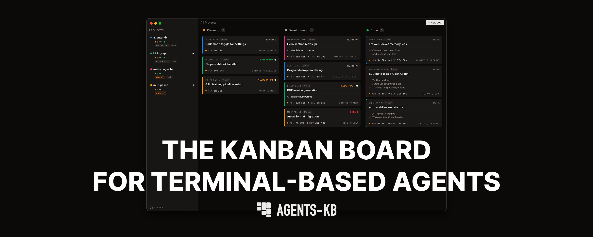

# Agents-KB

**[agents-kb.com](https://www.agents-kb.com/)**

*A desktop GUI for working with terminal-based coding agents in a Kanban-style workspace.*

Organize agent sessions, track progress visually, and move work through **Planning - Development - Done**.

Agents-KB does not build or provide the coding agents themselves. It gives you a visual layer on top of agent-driven terminal sessions so you can organize projects, track work, and move jobs through **Planning → Development → Done**.

## Important

- [Claude Code](https://code.claude.com/docs) is required to use the app
- Claude Code is developed separately and is not built by us
- Agents-KB is a companion GUI for coding agents, not a replacement for them
- This app is not perfect, so expect bugs.

## What You Get

- A desktop GUI for terminal-based coding agent sessions
- A Kanban workflow for managing agent work from planning through done
- Project-level organization for multiple agent jobs and sessions
- Live visibility into agent terminal output inside the app
- Saved projects and jobs between sessions

## Requirements

- [Claude Code](https://code.claude.com/docs) installed on your machine
- Claude Code authenticated and ready to use before opening Agents-KB

## Getting Started

1. Install and authenticate [Claude Code](https://code.claude.com/docs).
2. Download the latest Agents-KB release from the [GitHub Releases page](https://github.com/SignorCrypto/agents-kb/releases).
3. Install the app for your platform:
   - macOS: download the `.dmg`, open it, and drag Agents-KB into `Applications`
   - Windows: not available yet (sorry).
4. Open Agents-KB.
5. Add your project folder.
6. Create jobs and manage your terminal-based agent sessions from the Kanban board.

## Contributing

It is my first open source project.

If you like it and want to help, I really appreciate the interest. I will start accepting contributions once I figure out the best way to manage them. I will probably try to rely more on a concept I designed which are the prompt requests. You can read more about that idea here: [Prompt Requests](https://github.com/SignorCrypto/prompt-request).

For the current contribution status, see [CONTRIBUTING.md](./CONTRIBUTING.md).

## License

MIT. See [LICENSE.md](./LICENSE.md).
